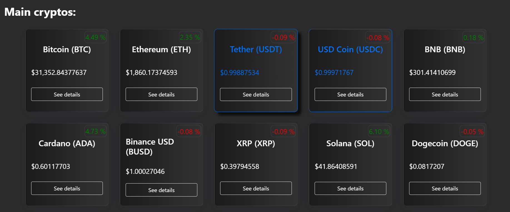
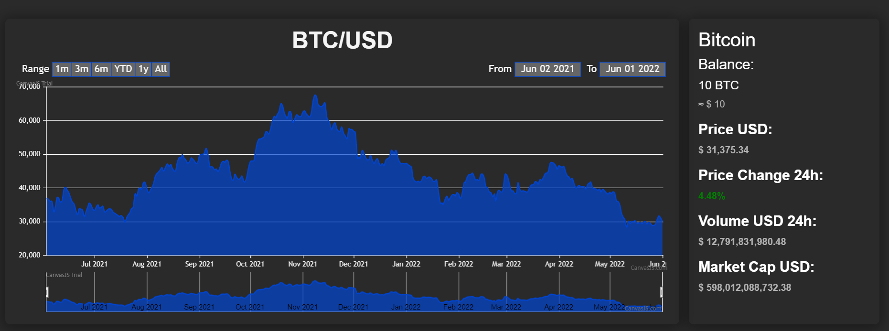

<!-- PROJECT SHIELDS -->

[![Contributors][contributors-shield]][contributors-url] [![Forks][forks-shield]][forks-url] [![Stargazers][stars-shield]][stars-url] [![Issues][issues-shield]][issues-url]

<!-- ABOUT THE PROJECT -->
## About The Project

[![Product Name Screen Shot][product-screenshot]](https://example.com)

CryptoWatchers is a project made for tracking crypto prices and managing portfolio, it was made also for the last project of the Web Technologies subject at Insper. You can see the demo live demo at **cryptowatchers.vercel.app/**.
To see the backend of the project, [click here](https://github.com/RicardoRibeiroRodrigues/cryptowatchers-backend).

### Built With

*  [](https://nextjs.org)
* [](https://reactjs.org)
* [](https://getbootstrap.com) 

<!-- GETTING STARTED -->
## Getting Started

To get a local copy up and running follow these simple steps.

### Installation
 
1. Clone the repo
```sh
git clone https://github.com/insper-tecnologias-web/projeto-3-crypto-watcher-front
```
2. Install the dependencies.
In the project root:
```sh
npm install
```
3. Run the project:
```sh
npm run dev
```

<!-- USAGE EXAMPLES -->
## Usage

**Feature list:**
- CRUD made in django (1pt);
- User authentication (2pts);
- FrontEnd made with next.js (2pts);
- Adding cryptos to your portifolio (1pt);
- Managing the user's crypto portifolio (1pt);
- Graphs for the cryptos in the crypto page (2pts);
- Listing cryptos from the coinCap API (1pt).

**For the roadmap of this project, please refer to [projects](https://github.com/insper-tecnologias-web/projeto-3-crypto-watcher-front/projects)**

This project offer many features, some are listed below:
- Seeing the main cryptos and their price/price variation:


- Seeing more info in a specific crypto:



<!-- CONTACT -->
## Contact

- [Ricardo Ribeiro Rodrigues](https://github.com/RicardoRibeiroRodrigues) - ricardorr7@al.insper.edu.br     
- [Guilherme Fontana Louro](https://github.com/guifl2001) - guilhermefl3@al.insper.edu.br        
- [Giancarlo Vanoni Ruggiero](https://github.com/Gian2608) - giancarlovr@al.insper.edu.br    
- [Pedro Altobelli Pinto](https://github.com/pedroaltobelli23) - pedroatp@al.insper.edu.br            

Project Link: [https://github.com/insper-tecnologias-web/projeto-3-crypto-watcher-front](https://github.com/insper-tecnologias-web/projeto-3-crypto-watcher-front)


<!-- ACKNOWLEDGEMENTS -->
## Acknowledgements

* The [CoinCap API](https://docs.coincap.io) is used to fetch information about cryptos in this project.


<!-- MARKDOWN LINKS & IMAGES -->
<!-- https://www.markdownguide.org/basic-syntax/#reference-style-links -->
[contributors-shield]: https://img.shields.io/github/contributors/insper-tecnologias-web/projeto-3-crypto-watcher-front.svg?style=flat-square
[contributors-url]: https://github.com/insper-tecnologias-web/projeto-3-crypto-watcher-front/graphs/contributors
[forks-shield]: https://img.shields.io/github/forks/insper-tecnologias-web/projeto-3-crypto-watcher-front.svg?style=flat-square
[forks-url]: https://github.com/insper-tecnologias-web/projeto-3-crypto-watcher-front/network/members
[stars-shield]: https://img.shields.io/github/stars/insper-tecnologias-web/projeto-3-crypto-watcher-front.svg?style=flat-square
[stars-url]: https://github.com/insper-tecnologias-web/projeto-3-crypto-watcher-front/stargazers
[issues-shield]: https://img.shields.io/github/issues/insper-tecnologias-web/projeto-3-crypto-watcher-front.svg?style=flat-square
[issues-url]: https://github.com/insper-tecnologias-web/projeto-3-crypto-watcher-front/issues
[license-shield]: https://img.shields.io/github/license/insper-tecnologias-web/projeto-3-crypto-watcher-front.svg?style=flat-square
[license-url]: https://github.com/insper-tecnologias-web/projeto-3-crypto-watcher-front/blob/master/LICENSE.txt
[product-screenshot]: Imgs/ProjectLogo.png
